# Sniffle - Internet Computer (ICP) AI Memecoin Intelligence

**Advanced AI-powered memecoin intelligence system for the Internet Computer (ICP) blockchain with voice-enabled interaction and real-time analytics.**

## Supported Chains

- **Internet Computer (ICP) Mainnet** - World Computer with Web3 services running at web speed
- **Wallet Support** - Internet Identity, Plug, Stoic, and other ICP wallets
- **Canister Integration** - Native integration with ICP canisters for decentralized data

## Key Features

- 🤖 **AI-Powered Analysis** - Advanced AI integration for sophisticated token evaluation
- 🎤 **Voice Interface** - Natural speech input and high-quality voice output
- 🔗 **ICP Integration** - Native support for Internet Computer and ICRC tokens
- 📊 **Real-Time Data** - Live token tracking and social sentiment analysis
- 🛡️ **Scam Detection** - Advanced filtering to identify rugpulls and fake projects
- 💬 **Custom AI Agent** - Conversational AI with retrieval-augmented generation
- 🚀 **Free Access** - Open platform for discovering ICP memecoins
- ⚡ **Web Speed** - Leveraging ICP's web-speed blockchain performance
- 🔐 **Secure Authentication** - Internet Identity for secure, passwordless access

## Our Memecoin Analysis Methodology

**Sniffle's AI-Powered Fundamental Analysis Framework**

Our system employs a comprehensive **5-Factor Risk Assessment Model** that prioritizes capital preservation while identifying legitimate opportunities on the Internet Computer. Here's how we analyze every memecoin:

### 🚨 Critical Risk Factors We Assess

**1. LIQUIDITY HEALTH** 🏊‍♂️
- **Canister Liquidity Analysis**: Tokens with low liquidity pools flagged as HIGH RISK
- **Slippage Risk Assessment**: Low liquidity = difficulty executing large trades
- **Exit Strategy Viability**: Can you actually get your money out?
- **Volume-to-Liquidity Ratio**: High ratios suggest potential manipulation

**2. AGE-BASED SECURITY** ⏰
- **Brand New (<24 hours)**: EXTREME RUG PULL RISK
- **Very New (<7 days)**: HIGH RISK - critical phase for legitimacy
- **Young (<30 days)**: MODERATE RISK - establishing on-chain history
- **Established (>90 days)**: LOWER RISK - proven track record on ICP

**3. VOLATILITY PATTERNS** 📈📉
- **Extreme Volatility**: Possible manipulation indicators
- **Manipulation Detection**: Unusual trading patterns on ICP DEXs
- **Healthy Volatility Range**: 20-50% daily for memecoins is normal
- **Chain-Key Signatures**: Analyzing transaction patterns for anomalies

**4. CANISTER SECURITY** 🔒
- **Canister Control**: Analysis of canister controller status
- **Smart Contract Review**: Detection of malicious patterns in Motoko/Rust code
- **Token Standards Compliance**: Verification against ICRC standards
- **Audit Status**: Third-party security review verification

**5. COMMUNITY AUTHENTICITY** 👥
- **Organic Growth Verification**: Real engagement vs. artificial inflation
- **Developer Transparency**: Team identity and project documentation
- **Social Sentiment Analysis**: Genuine community vs. paid promotions
- **Holder Distribution**: Analysis of token distribution fairness

### 📊 Risk Assessment Framework

**Risk Levels (1-10 Scale):**
- **1-3: LOW RISK** - Established tokens with solid fundamentals
- **4-6: MEDIUM RISK** - Some concerns but manageable with proper position sizing
- **7-8: HIGH RISK** - Multiple red flags, very small positions only
- **9-10: EXTREME RISK** - Avoid entirely or exit immediately

**Potential Levels (1-10 Scale):**
- **8-10: HIGH POTENTIAL** - Strong fundamentals + compelling narrative + authentic community
- **5-7: MEDIUM POTENTIAL** - Some positive factors with moderate upside
- **1-4: LOW POTENTIAL** - Limited catalysts or declining metrics

### 🛡️ Position Sizing Recommendations

Our AI provides specific portfolio allocation guidance:
- **Low Risk (1-3)**: Up to 5-10% of portfolio allocation
- **Medium Risk (4-6)**: 2-5% of portfolio maximum
- **High Risk (7-8)**: 1-2% of portfolio maximum
- **Extreme Risk (9-10)**: Avoid entirely or <1% speculation only

### ⚠️ Automatic Red Flag Detection

Our system immediately warns users about:
- Zero or unknown liquidity data
- Daily price changes exceeding 200%
- Unverified or suspicious contract information
- Anonymous teams making unrealistic promises
- Sudden coordinated social media campaign patterns

### 🎯 Investment Philosophy

**Capital Preservation First**: We prioritize avoiding total loss over chasing maximum gains. Our philosophy: "Better to miss a 10x than lose everything on a rug pull."

**Our Analysis Helps Users:**
- Avoid total loss scenarios through comprehensive risk assessment
- Size positions appropriately based on individual risk profiles
- Identify genuine opportunities with long-term staying power
- Plan exit strategies before entering positions
- Make data-driven decisions rather than emotional trades

## Problem It Solves

An **AI-powered early detection system** specifically designed for **Internet Computer meme coins**, identifying **promising tokens before significant price movement** on the world's first web-speed blockchain.

Our **open platform** provides **professional-grade memecoin intelligence** for free, bringing sophisticated analytics to the ICP ecosystem.

## What Users Can Use It For

Our AI-powered system helps users:

- **Discover high-potential ICP meme coins early** - before major price surges, giving retail investors a critical edge in the ICP ecosystem.
- **Automate ICP token monitoring** - eliminating the need to manually scan social media, forums, and DEXs across the Internet Computer ecosystem.
- **Filter scams and rugpulls** - using behavioral and on-chain analysis to detect red flags on ICP, making trading safer.
- **Identify real community momentum** - distinguishing organic growth from paid shills or bot activity in the ICP ecosystem.
- **Level the playing field** - by reducing information asymmetry traditionally exploited by insiders, whales, and snipers.
- **Enter earlier for maximum ROI** - ensuring users don't miss the small window of explosive growth most meme coins experience early on.
- **Voice-enabled AI interaction** - use natural speech to query markets, get analysis, and receive trading insights hands-free.
- **ICP blockchain analysis** - leverage specialized AI understanding of Internet Computer's architecture for deeper insights.
- **Free intelligence access** - unlimited access to all features without payment barriers.

## AI Analysis Pipeline

## How It Improves the Status Quo

Traditional methods of discovering meme coins on the Internet Computer have major flaws:

- Discovering tokens **after** the pump = missed profits  
- **Manual research** across ICP DEXs wastes time and is error-prone  
- Hard to tell a **genuine project** from a scam in the rapidly evolving ICP ecosystem  
- **Insiders and bots** often move first on new tokens  
- Most tools can't separate **real hype from fake** in the ICP community  
- Retail traders often miss the **early-entry sweet spot** in the fast-growing ICP ecosystem  
- **No specialized tools** for analyzing canister smart contracts and ICP-specific token mechanics
- **Expensive subscriptions** that don't deliver consistent value

Our system solves all of this with **free access** and **professional-grade AI memecoin intelligence**.

## Market Opportunity Analysis

## Sniffle System Architecture

## Deployment & Infrastructure

Sniffle leverages the power of the Internet Computer's cloud infrastructure for its deployment:

- **Frontend Hosting**: Deployed on the Internet Computer for truly decentralized web hosting
- **Serverless Architecture**: Utilizes canisters for backend services and APIs
- **Decentralized Storage**: All static assets and data are stored on-chain

## Future Roadmap

We're committed to fully leveraging the Internet Computer's capabilities:

- [ ] **Q3 2024**: Migrate AI analysis services to ICP canisters
- [ ] **Q4 2024**: Implement decentralized data scrapers as canister services
- [ ] **Q1 2025**: Full decentralization of all backend services
- [ ] **Ongoing**: Continuous optimization of gas costs and performance

## Technology Stack Overview

**Component Breakdown**

- **Hosting:**  
  Services are designed for cloud deployment with modern infrastructure.

- **Frontend (Next.js):**  
  Handles Internet Identity authentication and wallet connection.  
  Supports multiple ICP wallets including Internet Identity, Plug, and Stoic.  
  Features voice input/output capabilities for hands-free AI interaction.  
  Free access to all AI-powered memecoin analysis features.

- **Smart Contract (Motoko/Rust):**  
  Deployed on Internet Computer for transparent access control.  
  Decentralized and auditable system.  
  Canister-based architecture for secure operations.

- **Scraper:**  
  Monitors ICP DEXs for token data across multiple protocols.  
  Scrapes social media for token-related discussions and sentiment analysis.  
  Monitors ICP ecosystem for emerging opportunities.

- **AI Analysis (Advanced AI Models):**  
  Analyzes social media and ICP token data.  
  Determines risk score, investment potential, and provides rationale.  
  Specialized analysis for ICP canister smart contracts and ecosystem dynamics.

- **Custom Agent (AI Models + RAG):**  
  Advanced AI agent with Retrieval-Augmented Generation.  
  Answers user queries with the latest ICP token data and in-depth analysis.  
  Supports natural voice interaction and text-to-speech responses.

- **Voice Interface:**  
  Speech recognition for natural voice commands and queries.  
  High-quality text-to-speech with customizable voice selection.  
  Hands-free trading insights and market analysis.

- **Access Control System:**  
  Canister-based access control.  
  Secure authentication with Internet Identity.  
  Automatic access verification and time tracking.  
  Seamless wallet integration.

- **ICP Integration:**  
  Native support for Motoko and Rust smart contract analysis.  
  Integration with Internet Computer for real-time blockchain data.  
  Multi-wallet support including Internet Identity, Plug, and Stoic.

## Feature Comparison Matrix

```mermaid
graph TB
    subgraph "Sniffle Features"
        A[✅ AI Analysis]
        B[✅ Voice Interface]
        C[✅ Scam Detection]
        D[✅ Move Contract Analysis]
        E[✅ Real-time Data]
        F[✅ 1 APT Fair Pricing]
        G[✅ Multi-wallet Support]
        H[✅ Early Detection]
    end
    
    subgraph "Traditional Tools"
        I[❌ Manual Research]
        J[❌ Text Only]
        K[❌ Basic Filtering]
    end
```

### Architecture Overview

**Backend Services (Node.js + Python Stack):**

- API server processes requests and coordinates data analysis
- Python AI agent provides intelligent token analysis and insights
- Web scrapers collect real-time data from ICP DEXs and social media

**AI Infrastructure:**

- Modern AI models for advanced analysis and pattern recognition
- Speech recognition for voice input processing
- Text-to-speech synthesis for voice responses

**Data Integration:**

- Real-time monitoring of ICP DEX data and ICRC token metrics
- Social sentiment analysis from social media and community platforms
- On-chain analytics from ICP blockchain data

## Why Sniffle vs. Traditional Tools?

```mermaid
graph LR
    subgraph "Sniffle Advantages"
        A[✅ Free Access]
        B[✅ Voice Interface] 
        C[✅ ICP Native]
        D[✅ AI-Powered]
        E[✅ Real-time Data]
        F[✅ Multi-Wallet]
        G[✅ Early Detection]
        H[✅ Risk Assessment]
    end
    
    subgraph "Competitor Limitations"
        I[❌ Expensive Subscriptions]
        J[❌ Text-Only Interface]
        K[❌ No ICP Support]
        L[❌ Manual Analysis]
        M[❌ Delayed Data]
        N[❌ $100+ Monthly]
        O[❌ Limited Wallets]
        P[❌ Late Discovery]
    end
    
    style A fill:#32cd32
    style B fill:#32cd32
    style C fill:#32cd32
    style D fill:#32cd32
    style E fill:#32cd32
    style F fill:#32cd32
    style G fill:#32cd32
    style H fill:#32cd32
    
    style I fill:#ff4444
    style J fill:#ff4444
    style K fill:#ff4444
    style L fill:#ff4444
    style M fill:#ff4444
    style N fill:#ff4444
    style O fill:#ff4444
    style P fill:#ff4444
```

**Summary:**  
Sniffle provides free, AI-powered memecoin intelligence for Internet Computer users through an innovative voice-enabled interface. The platform aggregates real-time blockchain and social data from the ICP ecosystem, then leverages advanced AI models for investment analysis and conversational intelligence, all delivered through a modern Next.js frontend with comprehensive ICP wallet integration and hands-free voice interaction capabilities.

---

## Success Metrics

*Sniffle - AI-powered Internet Computer memecoin intelligence, now with voice interaction capabilities.*
